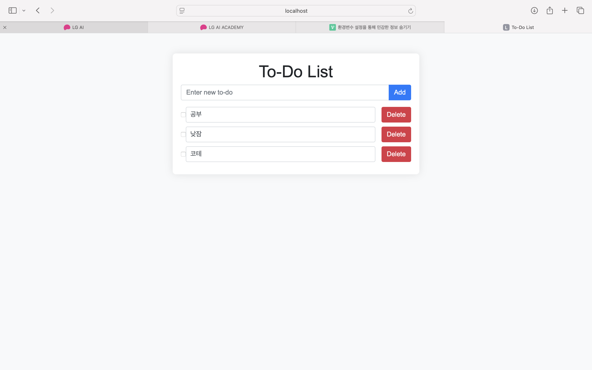

# TodoAPP

A simple Todo application built with Spring Boot and Kotlin, using MySQL for data storage.

## Table of Contents

- [Demonstration](#demonstration)
- [Features](#features)
- [Getting Started](#getting-started)
- [Prerequisites](#prerequisites)
- [Installation](#installation)
- [Usage](#usage)
- [API Endpoints](#api-endpoints)
- [Contributing](#contributing)
- [License](#license)


## Demonstration



## Features

- Create, read, update and delete todos
- RESTful API
- MySQL database integration

## Getting Started
Follow these instructions to get a copy of the project up and running on your local machine for development and testing 
purposes.


### Prerequisites
- Java 17 or higher
- Kotlin 1.6 or higher
- MySQL 8.0 or higher
- Gradle 7.0 or higher


### InStallation

1. **Clone the repository**
   ``` bash
   git clone https://github.com/choiyounghwan123/todoapp
   cd todo-app
   ```
2. **Setup MySQL database**
   ``` sql
   CREATE DATABASE todoapp;
    CREATE USER 'yourusername'@'localhost' IDENTIFIED BY 'yourpassword';
    GRANT ALL PRIVILEGES ON tododb.* TO 'yourusername'@'localhost';
    FLUSH PRIVILEGES;
    ```
3. **Configure `application.application**
   ```properties 
    spring.datasource.url=${DB_URL} # Environment variables
    spring.datasource.username=${DB_USERNAME} # Environment variables
    spring.datasource.password=${DB_PASSWORD} # Environment variables
    spring.datasource.driver-class-name=com.mysql.cj.jdbc.Driver
    spring.jpa.hibernate.ddl-auto=update
    spring.jpa.properties.hibernate.dialect=org.hibernate.dialect.MySQLDialect
    ```

4. **Set environment variables**
   Ensure that `DB_URL` and `DB_USERNAME` and `DB_PASSWORD` are set in your environment.
   You can add these to your shell profile or export them directly in your terminal session.

   ``` bash
     export DB_URL=yourMysqlServerUrl
     export DB_USERNAME=yourusername
     export DB_PASSWORD=yourpassowrd
   ```

5. **Bulid and run the application**
   ``` bash
     ./gradle bootRun
   ```

### Usage
Once the application is running, you can access the API at
`http://localhost:8080/api/todos`.

### API Endpoints
  ```http
  GET /api/todos
```

### Contributing
Contributions are welcome!

### License

This project is licensed under the MIT License - see the LICENSE file for details.

